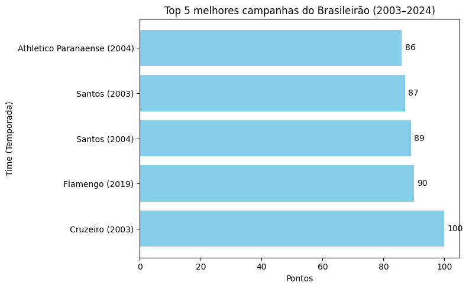
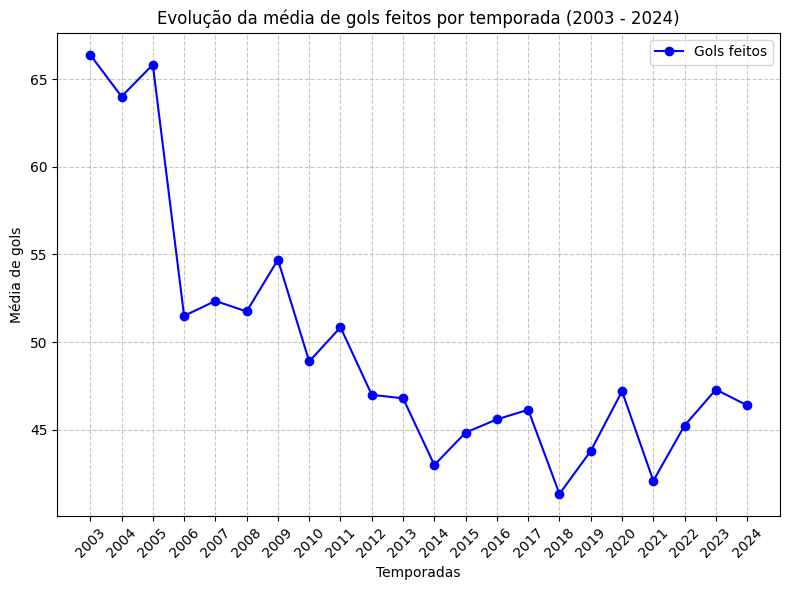
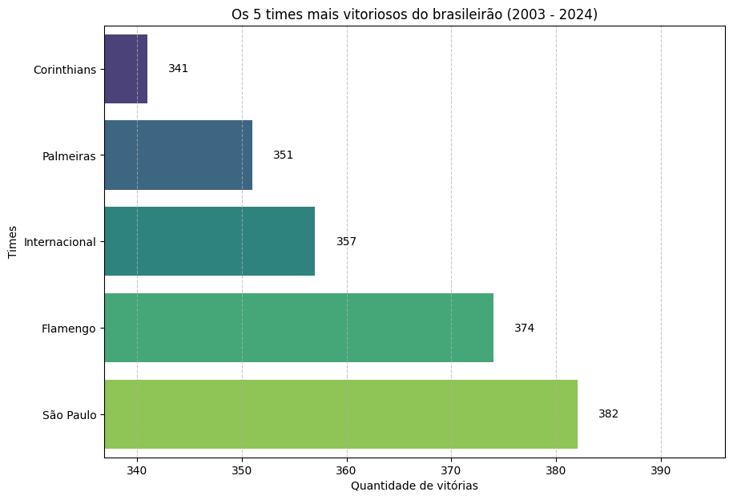
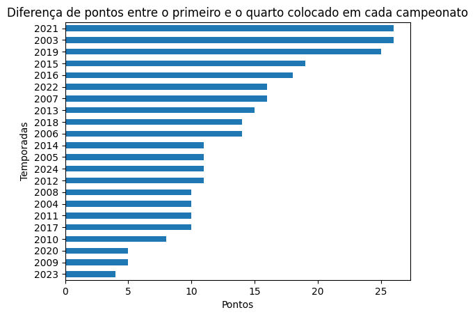

# 📊 Análise Histórica do Brasileirão (2003–2024)

Este projeto faz uma análise exploratória dos dados do Campeonato Brasileiro entre 2003 e 2024. Foram extraídos insights com auxílio das bibliotecas **Pandas**, **Matplotlib** e **Seaborn**, com o objetivo de observar padrões, desempenhos históricos e evoluções.

---

## 🔍 Insights explorados

- Os 5 times mais goleadores do brasileirão
- Top 5 times com mais vitoriosos do brasileirão
- Evolução da média de pontos por temporada
- Evolução da média de gols feitos por temporada
- Correlação entre total de gols feitos e total de pontos adquiridos
- Proporção de pontos por região do Brasil
- Diferença de pontos entre o 1º e o 4º colocado por ano
- Top 5 melhores campanhas da era dos pontos corridos

---

## 📂 Estrutura

```bash
notebook/ # O notebook onde foi feita a análise
data/ # Local onde está o dataset
images/ # Local onde estão as imagens de exemplos da análise feita
```
---

## 💻 Como executar

1. Clone o repositório
2. Crie um ambiente virtual
3. Instale as dependências com `pip install -r requirements.txt`
4. Rode o notebook no Jupyter

---

## 📷 Exemplos visuais










